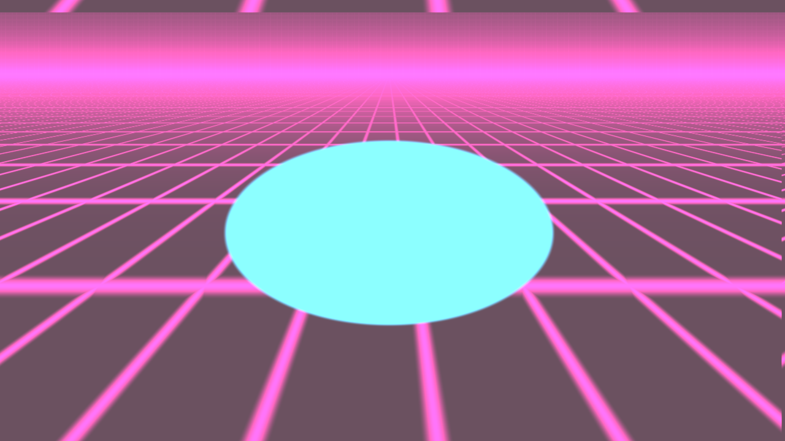

# AuroraMV

> 音乐驱动视觉 · 把一首歌变成一支 MV



AuroraMV 是一个开源的、用于**音乐可视化与音乐视频生成**的桌面应用。
导入一首歌（可选 LRC 歌词），选择视觉风格，实时预览，一键导出高质量 MV。
专注**自动视觉生成**，而非传统时间轴剪辑。

## ✨ 特性

- **音乐驱动视觉**：自动响应节拍 / 音量 / 低频 / 节奏（librosa 预分析 + 实时 AudioState）
- **六套系统预设包**：电影镜头 / 极光星云 / 赛博朋克 / 歌词舞台 / 合成波 / DJ 现场，
  一键切换、随音乐时间自动轮换
- **动态歌词**：LRC 解析（UTF-8/GBK 自动识别），入场淡入+上浮 / 待机辉光 / 节拍缩放 / 退场动画，
  霓虹 / 影院 / 极简三套歌词模板
- **可调节效果**：节拍震动 / 闪光 / GPU 粒子——UI 滑杆实时调节，JSON 模板持久化
- **所见即所导出**：预览与导出共用同一渲染管线（ModernGL + FFmpeg）
- **多格式导出**：MP4（H264）/ WebM（VP9）/ MOV，分辨率 360p–1440p、FPS 24/30/60、
  宽高比 16:9 / 9:16 / 1:1、码率自动(CRF)/手动
- **全模板化**：歌词 / 背景 / 效果 / 场景四类 JSON 模板——未来社区生态的基础
- **深色高级感 UI**：暗色主题、预设卡片、动画、实时预览面板

## 🚀 快速开始

**环境要求**：Windows 10+ ｜ Python ≥ 3.12 ｜ 现代 GPU（推荐 RTX 3060 或更高）｜ FFmpeg（需在 PATH 中）

```bash
git clone https://github.com/Kassell464/AuroraMV.git
cd AuroraMV
python -m venv venv
venv\Scripts\pip install -r requirements.txt
venv\Scripts\python main.py
```

启动即播放内置演示曲（自动轮换六套预设）。用你自己的歌：

```bash
venv\Scripts\python main.py --audio 你的歌.wav --lrc 歌词.lrc
```

### 导出视频（无窗口模式）

```bash
# 1080p / 60fps MP4
venv\Scripts\python main.py --export out.mp4 --resolution 1080p --fps 60

# 竖屏 9:16 WebM，只导出前 15 秒
venv\Scripts\python main.py --export out.webm --format webm --aspect 9:16 --trim 15

# 方形 MOV，手动码率
venv\Scripts\python main.py --export out.mov --format mov --aspect 1:1 --bitrate 8M
```

## 🎛 界面速览

左侧控制面板：**视觉风格卡片**（自动切换 + 六套预设）· **效果滑杆**（震动/闪光/粒子）·
**导出面板**（格式/分辨率/帧率/宽高比 + 进度条）· **播放控制**（脉冲指示灯）。
右侧为实时渲染预览（所见即所导出）。

## 🧰 技术栈

Python 3.12 · PySide6（UI） · ModernGL（GPU 渲染/着色器/粒子） ·
librosa / numpy / soundfile（音频分析） · pygame（播放） · Pillow（图片/文字纹理） · FFmpeg（导出）

## 📁 项目结构

```
AuroraMV/
├── main.py              # 入口：预览模式 + 导出模式 CLI
├── app/                 # 应用控制器与后台导出线程
├── ui/                  # UI 层（深色主题、控制面板、预览控件）
├── core/                # 核心：audio / renderer / lyrics / effects / templates
├── export/              # 导出系统（Exporter / ExportSettings）
├── templates/           # 四类 JSON 模板（歌词/背景/效果/场景）
├── assets/              # 演示音频、背景图片、演示视频
├── tests/               # 69 项测试（unittest，零额外依赖）
└── docs/                # 文档
```

## 📖 文档

- [用户指南](docs/USER_GUIDE.md)：安装、界面、导出选项、模板自定义
- [发布说明](docs/RELEASE_NOTES.md)：V0.1.0 功能清单与已知限制
- [架构](docs/architecture.md) · [任务看板](docs/task-board.md)
- [工程规格（中文版）](docs/AuroraMV%20V0.1%20工程规格说明（中文版）.md)

## 🧪 开发

```bash
venv\Scripts\python -m unittest discover -s tests -v
```

Git 工作流：`main`（发布）← `develop`（集成）← `feature/*`；
提交格式 `feat:` / `fix:` / `refactor:` / `docs:`。

## 🙏 灵感与致谢

视觉概念与气质参考了开源项目 [Mineradio](https://github.com/XxHuberrr/Mineradio)
（电影镜头、粒子舞台、歌词舞台、DJ 专属模式等方向）。
**仅借鉴概念**：本项目着色器、模板与素材均为原创实现；Mineradio 为 GPL-3.0，
其 Logo、名称与界面视觉设计归原作者所有。

## 📄 License

[MIT](LICENSE) © 2026 AuroraMV contributors
